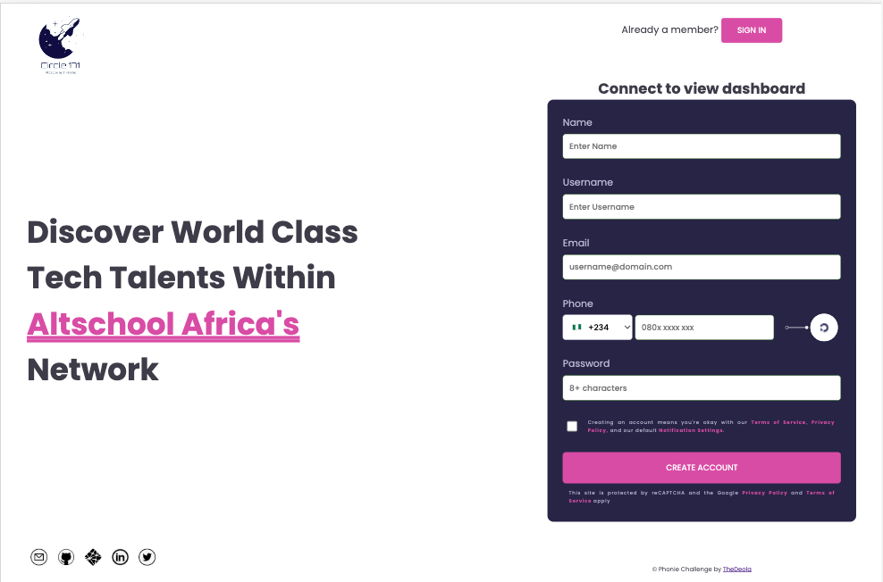
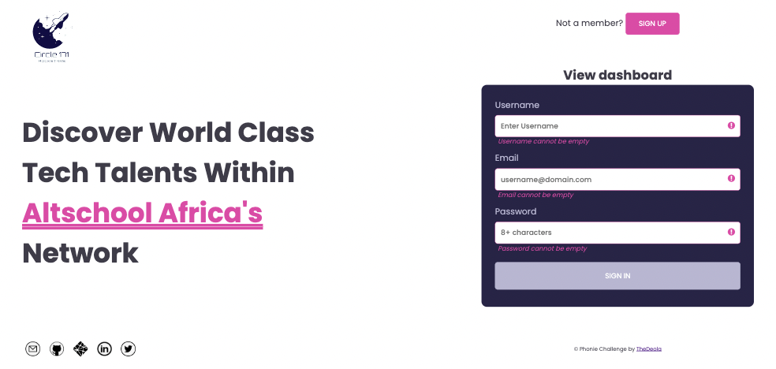
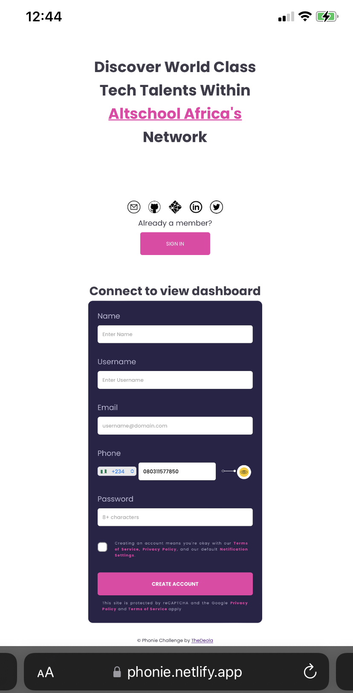

# AltSchool Semester 1 Holiday Challenge

### What
Solidify what you’ve learnt by building cool simple things you can showcase

### Why
Practice makes perfect. We’re getting you ready for all the fun projects in the coming semester

### How
*   Build any one of the below projects as a group / team, using Repl.it 
*   Vanilla HTML/CSS and Javascript is sufficient to build these projects as fully functional apps, so don’t use any fancy libraries or frameworks. Doing so can cost you some points!
*   It’s a healthy competition amongst teams, so try your best to make your application functional, clean and presentable

## Projects

> As a team, decide which of the below projects you are excited about, then go ahead and build it. 
---
> Make sure to *always* update the `app.properties` file within the project codebase to reflect the choice of project as well as details of the team Rep and all the members working to build it. 

# Phonie: Identify the telecoms carrier from a phone number

This is the solution to the Phonie Challenge Holiday Circle Hackathon set by [Altschool Africa](https://www.altschoolafrica.com/). 

## Table of contents

- [Overview](#overview)
  - [Scenario](#senario)
  - [Outcome](#outcome)
  - [Advanced features](#advanced-features)
  - [Screenshot](#screenshot)
  - [Links](#links)
- [Process](#process)
  - [Built with](#built-with)
  - [Useful resources](#useful-resources)
- [Author](#author)

## Overview

#### Scenario

A user is filling a form in your web application and they are required to enter their phone number into a form field.

#### Outcome

After typing the phone number into the form field, the UI indicates that it is an MTN or GLO or Airtel or Etisalat number e.t.c (e.g if its an MTN line, display the MTN icon/logo somewhere beside the form field)

#### Advanced features (OPTIONAL- build any, some or all of the following if you feel up to it) 

* Add validation - Use the `pattern` attribute of the HTML form field to restrict phone numbers to a certain carrier, e.g restrict to only Airtel such that entering an MTN/GLO number would be invalid
* Support +XYZ country codes (e.g +234 for Nigeria) - Still detect the carrier even if the user prefixed the number with their +XYZ country code
* Show auto-completion - Show suggestions as the user starts typing the phone number. E.g once they type 080, show them that 080*3* and 080*6* and other possible *matching* variants of the carrier

### Screenshot

 
### Links

- Solution URL: [Solution](https://github.com/TheDeola/Circle-171---Holiday-Challenge)
- Live Site URL: [Live Site](https://thedeola.github.io/Circle-171---Holiday-Challenge/)

## Process

### Built with

- Semantic HTML5 markup
- CSS custom properties
- Flexbox
- Mobile-first workflow
- [Vanilla js](https://www.codegrepper.com/code-examples/javascript/javascript+set+input+to+src)

### Useful resources

- [Altschool Africa](https://thealtschool.com/lessons/javascript-fundamentals/)
- [W3schools](https://www.w3schools.com/js/default.asp)
- [MDN](https://www.example.com) 

## Author

- Website - [TheDeola](https://thedeola.netlify.app/)
- Frontend Mentor - [@TheDeola](https://www.frontendmentor.io/profile/TheDeola)
- Twitter - [@deolacodes](https://www.twitter.com/deolacodes)